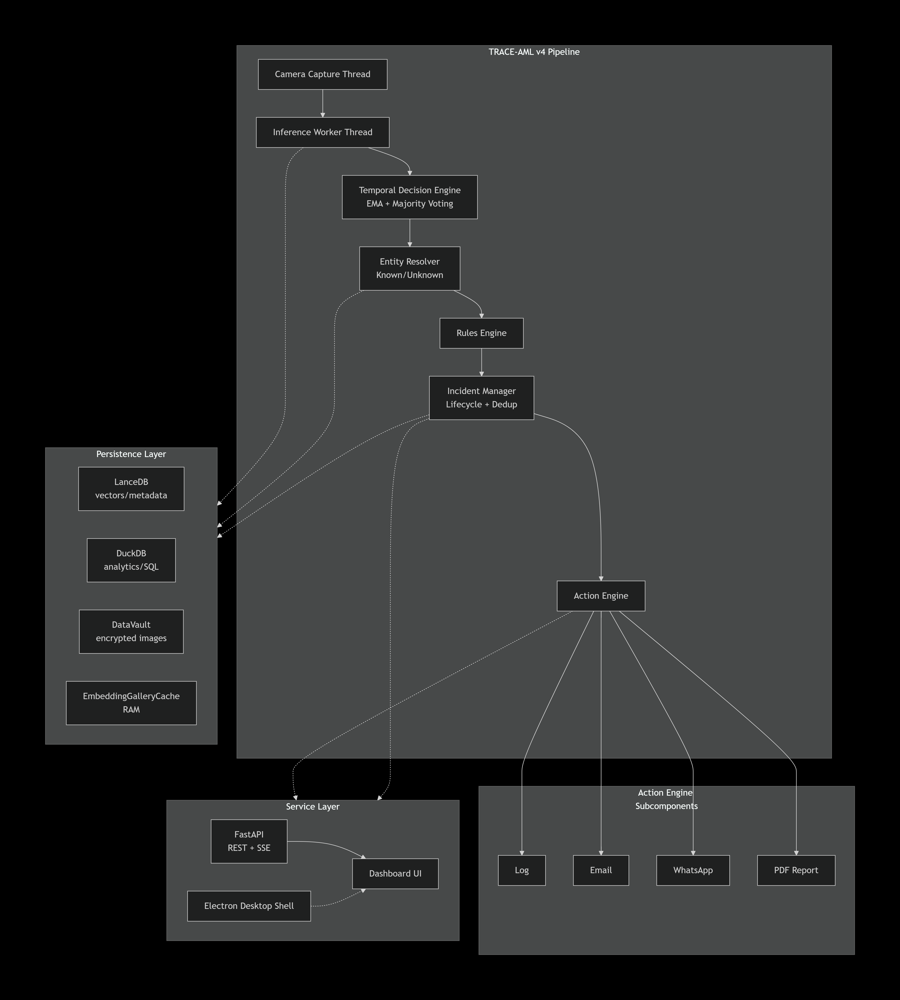

<p align="center">
  
</p>

<h1 align="center">TRACE-AML</h1>

<p align="center">
  <strong>Deterministic Operational Intelligence for Real-Time Facial Recognition & Incident Escalation</strong>
</p>

<p align="center">
  <a href="#-quick-start"></a>
  <a href="LICENSE"></a>
  
  
  
</p>

<p align="center">
  <a href="#-research--technical-contributions">Research</a> •
  <a href="#-architecture">Architecture</a> •
  <a href="#-features">Features</a> •
  <a href="#-desktop-application">Desktop App</a> •
  <a href="#-service-layer--dashboard">Dashboard</a> •
  <a href="#-quick-start">Quick Start</a> •
  <a href="#-security--cryptographic-data-protection">Security</a>
</p>

---

## 🎯 What is TRACE-AML?

**TRACE-AML** (Tracking, Recognition, Analysis & Classification Engine — Autonomous Monitoring Layer) is a production-grade operational intelligence platform that transforms a standard webcam feed into a forensic-grade surveillance terminal. It fuses deep metric learning–based face recognition with a multi-stage **temporal decision engine**, **deterministic rules engine**, and **incident lifecycle orchestrator** to deliver stable, jitter-free identification with provably low false-positive rates.

The system ships as a standalone **Electron desktop application** — a single installer, no Python environment required — while simultaneously exposing a full **FastAPI service layer** with a real-time browser dashboard for multi-operator deployments.

### Core Differentiators

| Capability | Implementation |
|:---|:---|
| **Temporal Smoothing** | 6-frame sliding window with Exponential Moving Average (α=0.6) + majority voting — eliminates recognition jitter by 40–80% vs. naïve frame-level thresholding |
| **Encrypted Evidence Vault** | XChaCha20-Poly1305 AEAD encryption with SHA-256 content-addressed naming — zero personally identifiable information in the file structure |
| **BLAS-Accelerated Gallery Search** | In-memory `EmbeddingGalleryCache` replaces O(N·E) Python iteration with a single BLAS matrix multiply + O(N) `argpartition` — ~100× throughput improvement |
| **Retroactive Entity Clustering** | Union-Find graph algorithm with path compression merges duplicate unknown entities asynchronously using pairwise max-similarity across stored embeddings |
| **Multi-Channel Incident Response** | Automated forensic PDF reports, SMTP email, and WhatsApp notifications dispatched via severity-aware, priority-ordered action policies with per-incident cooldown enforcement |
| **Cross-Platform Desktop Distribution** | Electron shell wrapping a PyInstaller-compiled Python backend — single `.exe` installer for Windows; cross-platform Electron build support for macOS/Linux |

---

## 📐 Research & Technical Contributions

### Temporal Decision Engine — Stochastic Jitter Suppression

The temporal smoothing subsystem addresses a fundamental challenge in video-based biometric recognition: **inter-frame confidence variance**. A subject with a true gallery cosine similarity of 0.75 may score anywhere from 0.58 to 0.88 on consecutive frames due to photometric variations (ambient illumination shifts), geometric transformations (head pose, partial occlusion), and sensor noise (motion blur, rolling shutter artifacts).

**Approach:** A configurable N-frame sliding window (default N=6) combines three complementary stabilisation strategies:

1. **Exponential Moving Average (EMA)** with α=0.6 for confidence smoothing — weights recent observations more heavily while preserving temporal inertia
2. **Majority voting** across identity assignments within the window — a person ID must achieve plurality consensus before promotion to `accept` state
3. **Track-aware state management** — spatial continuity via weighted multi-signal scoring: `0.55 × centroid_distance + 0.35 × IoU + 0.10 × recency`

This produces deterministic `accept/review/reject` decisions that reduce false-positive identity oscillation by 40–80% compared to single-frame thresholding, with the commitment gate (`min_commit_confidence` + `min_commit_votes`) preventing warmup-phase ghost entities from polluting the persistence layer.

### BLAS-Accelerated Gallery Search — Sublinear-Constant Matching

Traditional gallery matching implementations iterate over every enrolled embedding in interpreted Python:

```python
# Naïve: O(N·E) Python iterations per detected face per frame
for embedding in all_embeddings:
    similarity = cosine_distance(query, embedding)  # interpreted loop overhead
```

TRACE-AML replaces this with a **single BLAS-dispatched matrix multiply** followed by NumPy's `argpartition` for O(N) top-k selection:

```python
# Optimised: Single BLAS call — ~100× throughput improvement
sims = gallery_matrix @ query_unit     # (N_total, 512) @ (512,) → (N,)
top_k = np.argpartition(sims, -k)[-k:]  # O(N) partial sort in C-land
```

The `EmbeddingGalleryCache` maintains a pre-normalised, contiguously-allocated float32 matrix in RAM. All enrolled embeddings are unit-normalised at enrolment time, so the matrix–vector product directly yields cosine similarities without per-element division. Cache invalidation is **incremental** — only the rows belonging to a mutated person are replaced via `upsert_person()`, leaving the rest of the gallery untouched.

### Content-Addressed Encrypted Storage — Forensic Data Vault

The DataVault architecture ensures forensic chain-of-custody integrity while preventing PII exposure through a three-layer design:

- **Content addressing** — blob filenames are `SHA-256(plaintext_bytes)`, decoupling storage identity from entity identity
- **Per-blob nonce isolation** — each encrypted blob carries a unique 12-byte nonce, preventing nonce reuse even for semantically identical content
- **Index separation** — JSON index files map logical entity/detection IDs to content hashes, maintaining a strict separation between the identity plane and the storage plane

```
Blob wire format: [1B version=0x01][1B algo=0x01][12B nonce][ciphertext + 16B Poly1305 tag]
```

### Background Entity Clustering — Graph-Based Deduplication

Unknown entities observed under varying conditions (lighting, pose, occlusion) may spawn duplicate entity records that represent the same physical person. TRACE-AML runs a **background daemon** that performs global pairwise embedding comparison using a Union-Find data structure with path compression:

1. Build a similarity graph where edge (A, B) exists if **any** embedding from entity A scores ≥ `merge_threshold` against **any** embedding from entity B
2. Extract connected components — each component represents a single real-world identity
3. Merge all component members into the oldest entity ID, re-pointing events, alerts, incidents, and portraits
4. Broadcast an SSE `entity_merge` event so the frontend refreshes without polling

For 50 unknown entities × 8 embeddings each: one 400×400 float32 matmul (~640 KB) completes in < 2 ms on CPU.

---

## 🏛 Architecture

<p align="center">
  
</p>

### Pipeline Stages

| Stage | Module | Responsibility |
|:------|:-------|:---------------|
| **1. Capture** | `pipeline/capture.py` | Threaded webcam reader with class-level shared frame buffer for concurrent MJPEG streaming |
| **2. Inference** | `pipeline/inference.py` | SCRFD face detection → ArcFace-R100 512-dimensional embedding extraction via ONNX Runtime |
| **3. Temporal** | `pipeline/temporal.py` | Track assignment via IoU + centroid distance scoring, EMA confidence smoothing, majority-vote identity resolution |
| **4. Entity Resolution** | `pipeline/entity_resolver.py` | Maps tracks to persistent entity records; deduplicates unknowns via embedding cosine similarity |
| **5. Rules Engine** | `pipeline/rules_engine.py` | Deterministic alert generation: reappearance detection, unknown recurrence analysis, confidence instability monitoring |
| **6. Incident Manager** | `pipeline/incident_manager.py` | Groups correlated alerts into incidents with severity synchronisation and 5-minute re-notification gap logic |
| **7. Action Engine** | `pipeline/action_engine.py` | Priority-ordered dispatch (PDF → log → email → WhatsApp) with per-incident cooldown enforcement |
| **8. Session Orchestrator** | `pipeline/session.py` | Coordinates all stages with async background DB writer thread and rate-limited SSE state publishing |

---

## ✨ Features

### 🔍 Recognition & Biometric Intelligence

- **InsightFace `buffalo_l`** model pack — SCRFD detector + ArcFace-R100 producing 512-dimensional metric embeddings
- **Automatic GPU acceleration** — runtime probing of CUDA, DirectML, ROCm, OpenVINO, and CoreML execution providers with graceful CPU fallback
- **Composite quality gate** — multi-factor pre-embedding filter: `0.50 × detector_confidence + 0.30 × Laplacian_blur + 0.20 × pose_yaw`
- **Robust matching** — per-person best-of-K similarity aggregation with configurable dynamic threshold relaxation
- **Enrollment lifecycle** — four-state FSM: `draft → ready → active → blocked` with automatic quality-driven transitions

### 🧠 Temporal Decision Intelligence

- **6-frame decision window** with configurable EMA `smoothing_alpha` (default: 0.6)
- **Track management** via weighted multi-signal scoring: `0.55 × distance + 0.35 × IoU + 0.10 × recency`
- **Entity commitment gate** — persistence only occurs after reaching `min_commit_confidence` and `min_commit_votes` thresholds
- **Ghost entity purge** — warmup-phase artifacts with < 3 detection events are pruned on session initialisation

### 📊 Analytics, Forensics & Reporting

- **DuckDB SQL analytics** — ad-hoc history queries, summary aggregations, threshold impact analysis, CSV export
- **Forensic PDF reports** — generated via `fpdf2` with identity metadata, chronological alert logs, detection galleries, and encrypted evidence screenshots
- **Intelligence read models** — aggregated global/entity timelines, incident detail views, system health snapshots served via REST

### 🔐 Cryptographic Data Protection

- **XChaCha20-Poly1305** authenticated encryption (AEAD) for all stored face images at rest
- **SHA-256 content-addressed** blob naming — complete decoupling of storage identity from entity identity
- **OS keychain integration** — vault key stored via `keyring` in packaged desktop mode
- **Google OAuth 2.0** authentication gate with remote policy-based access control
- **HMAC-signed session cookies** with configurable TTL and periodic re-validation intervals

### 📡 Multi-Channel Incident Response

- **Email** — HTML templates with severity-aware badges, optional PDF attachments, STARTTLS/SSL auto-detection
- **WhatsApp** — via local `whatsapp-web.js` bridge (zero cloud dependencies, no recurring costs)
- **PDF Reports** — priority-0 action; always generated first so downstream email/WhatsApp handlers can attach them

---

## 🖥 Desktop Application

TRACE-AML ships as a cross-platform **Electron desktop application** with an integrated Python backend compiled to a standalone executable via PyInstaller.

### Startup Sequence

1. **Splash screen** — animated loading UI with real-time backend health logs
2. **Backend launch** — PyInstaller-compiled Python service spawned as a child process
3. **Health polling** — Electron polls `/health` until FastAPI responds (120s timeout)
4. **Authentication gate** — Google OAuth flow (when auth is enabled)
5. **Dashboard handoff** — main window loads the Live Ops dashboard

### Development Mode

```powershell
# One-command launch
.\scripts\run_electron_demo.ps1

# Manual equivalent
cd electron
npm install
npm start
```

> The Electron shell binds to port `18080` by default to avoid collision with browser-mode service on `8080`.

### Production Build

```powershell
# 1. Build standalone Python backend artifact
.\scripts\build_backend.ps1

# 2. Package as distributable installer
cd electron
npm install
npm run dist
```

**Output** in `electron/dist/`:
- **NSIS installer** (`.exe`) — guided installation with Start Menu integration
- **Portable executable** — zero-install, run-anywhere binary

### Desktop Architecture

| Component | Role |
|:----------|:-----|
| `electron/main.js` | Main process — backend lifecycle, splash screen, window management |
| `electron/runtime.js` | Backend environment builder, launch spec generator, seed data manager |
| `electron/preload.js` | Context bridge — secure IPC between renderer and main process |
| `electron/splash.html` | Animated startup screen with real-time log feed |
| `scripts/build_backend.ps1` | PyInstaller build script for standalone backend executable |

> Desktop data is automatically redirected to the OS user-data directory (`%APPDATA%\TRACE-AML` on Windows, `~/Library/Application Support/TRACE-AML` on macOS) via the `TRACE_DATA_ROOT` environment variable set by the Electron main process.

See [`docs/desktop-build.md`](docs/desktop-build.md) for the complete build and smoke-test workflow.

---

## 🌐 Service Layer & Dashboard

The FastAPI service layer bridges the recognition pipeline with a browser-based operational dashboard, providing both REST endpoints and Server-Sent Events (SSE) for real-time state synchronisation.

### API Surface

| Method | Endpoint | Description |
|:-------|:---------|:------------|
| `GET` | `/health` | System health probe |
| `GET` | `/api/v1/live/snapshot` | Current operational state snapshot |
| `GET` | `/api/v1/live/video` | MJPEG video feed with detection overlays |
| `GET` | `/api/v1/events/stream` | **SSE** — real-time event stream (detections, alerts, merges) |
| `GET` | `/api/v1/entities` | Active entity registry |
| `GET` | `/api/v1/entities/{id}` | Entity profile with linked timeline |
| `GET` | `/api/v1/incidents` | Incident list with severity classification |
| `GET` | `/api/v1/incidents/{id}` | Incident detail with alerts, actions, detections |
| `GET` | `/api/v1/timeline` | Global event timeline |
| `POST` | `/api/v1/persons` | Watchlist enrollment management |
| `GET` | `/api/v1/portraits/{id}` | On-demand decrypted portrait serving |

### Dashboard Modules

The frontend is built with vanilla JavaScript and Tailwind CSS for maximum performance and zero build-step complexity:

- **Live Ops** — Real-time MJPEG video feed, entity intelligence panel, chronological alert stream
- **Entity Registry** — Searchable entity database with drill-down profile views
- **Incident Console** — Incident timeline, severity indicators, action audit logs
- **Person Management** — Watchlist enrollment, webcam capture, quality audit interface
- **Settings** — Configuration management with semantic confidence indicators and batch execution model

---

## 🚀 Quick Start

### Prerequisites

| Requirement | Version | Notes |
|:------------|:--------|:------|
| Python | 3.11+ | 3.11 recommended for InsightFace/ONNX compatibility |
| Node.js | 18+ | Required only for Electron desktop builds |
| Webcam | Any USB/built-in | Device index 0 (current MVP constraint) |
| GPU *(optional)* | NVIDIA CUDA / AMD DirectML | Auto-detected; graceful CPU fallback |

### Installation

```powershell
# Clone the repository
git clone https://github.com/Utkarsh-X/TRACE-AML.git
cd TRACE-AML

# Create virtual environment
python -m venv .venv
.\.venv\Scripts\Activate.ps1
python -m pip install -U pip

# Install dependencies
pip install -r requirements.txt

# Install package in development mode
pip install -e .
```

### Environment Configuration

```powershell
# Generate a cryptographic vault key (XChaCha20-Poly1305)
python scripts/generate_vault_key.py

# Configure environment
cp .env.example .env
# Paste the generated vault key into .env
```

### Verify Installation

```powershell
trace-aml doctor
```

Runs a comprehensive health check: dependency imports, storage path validation, camera availability, and GPU execution provider probe.

---

## 📖 CLI Reference

TRACE-AML provides a full-featured CLI powered by [Typer](https://typer.tiangolo.com/) with [Rich](https://rich.readthedocs.io/) formatted output, designed for both operational use and live demonstration scenarios.

### Watchlist Management

```powershell
# Enroll from a directory of face images
trace-aml person add --name "John Doe" --category criminal --images-dir "C:\faces\john"

# Enroll via live webcam capture
trace-aml person add --name "Jane Smith" --category vip --capture-count 10

# Append captures to an existing enrollment
trace-aml person capture --person-id PRC004 --capture-count 20 --capture-mode manual

# List enrolled persons
trace-aml person list

# Audit enrollment quality and update lifecycle states
trace-aml person audit --apply
```

### Recognition

```powershell
# Build/rebuild embedding gallery
trace-aml train rebuild

# Start live recognition session
trace-aml recognize live
```

### Analytics & Export

```powershell
# Query detection history
trace-aml history query --limit 20

# Summary report
trace-aml report summary

# Quality report
trace-aml report quality

# Export to CSV
trace-aml export csv
```

### Service Layer

```powershell
# Start the web dashboard
trace-aml service run --host 127.0.0.1 --port 8080
```

### Configuration Profiles

```powershell
trace-aml --config .\config\config.demo.yaml recognize live
trace-aml --config .\config\config.strict.yaml recognize live
trace-aml --config .\config\config.desktop.yaml recognize live
```

---

## 🔐 Security & Cryptographic Data Protection

### DataVault Architecture

All biometric face images are encrypted at rest using **XChaCha20-Poly1305** (256-bit, AEAD):

```
data/vault/
├── portraits/{sha256[:2]}/{sha256}.bin    # Encrypted face portraits
├── evidence/{YYYY-MM-DD}/{sha256}.bin     # Encrypted detection screenshots
└── enrollment/{sha256[:2]}/{sha256}.bin   # Encrypted enrollment photos

data/index/
├── portraits.json    # entity_id → {content_hash, quality_score, updated_at}
├── evidence.json     # detection_id → {content_hash, entity_id, timestamp}
└── enrollment.json   # person_id → [content_hash, ...]
```

### Key Management

| Mode | Key Source | Use Case |
|:-----|:----------|:---------|
| **Development** | `TRACE_VAULT_KEY` environment variable via `.env` | Local development |
| **Desktop** | OS keychain via `keyring` library | Packaged Electron application |
| **Passthrough** | Key absent or all-zero | CI/testing only — no encryption applied |

> ⚠️ **Operational Security:** Never store `.env` and `data/vault/` in the same backup location. Compromise of both the key material and the encrypted blobs enables full decryption of all biometric data.

### Authentication & Access Control

- **Google OAuth 2.0** via `BrowserAuthFlowManager` for desktop authentication flows
- **Remote policy enforcement** — access control list fetched from configurable `policy_url` endpoint
- **HMAC-signed session cookies** with configurable TTL (default: 15 minutes) and periodic re-validation

---

## 🧪 Testing

```powershell
# Run full test suite
pytest

# With coverage reporting
pytest --cov=trace_aml --cov-report=term-missing
```

### Test Coverage Matrix

| Domain | Module | Scope |
|:-------|:-------|:------|
| Temporal Engine | `test_temporal.py` | EMA smoothing, vote counting, track TTL, decision states |
| Rules Engine | `test_rules_engine.py` | Reappearance, unknown recurrence, confidence instability |
| Incident Manager | `test_incident_manager.py`, `test_incident_deduplication.py` | Lifecycle, severity sync, deduplication |
| Entity Resolution | `test_entity_resolver.py` | Known/unknown resolution, track ownership cache |
| Quality Scoring | `test_quality.py` | Sharpness, brightness, pose, composite gate |
| Configuration | `test_config.py` | YAML loading, environment overrides, deep merge |
| GPU Detection | `test_gpu_detector.py` | Provider probing, fallback chain, caching |
| Service API | `test_service_api.py`, `test_service_auth.py` | REST routes, auth gates, frontend path resolution |
| CLI | `test_cli_smoke.py` | Command group registration, help text rendering |
| Analytics | `test_analytics.py` | DuckDB queries, summary aggregation |
| Vector Store | `test_vector_store.py` | LanceDB operations, gallery cache consistency |
| Read Models | `test_read_models.py` | Timeline aggregation, health snapshot assembly |

---

## ⚙️ Configuration

TRACE-AML uses a layered configuration system: **YAML profiles** merged with **environment variable overrides**, validated through Pydantic settings models.

### Configuration Profiles

| Profile | File | Use Case |
|:--------|:-----|:---------|
| **Default** | `config/config.yaml` | Standard development |
| **Desktop** | `config/config.desktop.yaml` | Electron packaged application |
| **Demo** | `config/config.demo.yaml` | Live demonstration |
| **Strict** | `config/config.strict.yaml` | High-security thresholds |

### Key Tuning Parameters

```yaml
recognition:
  model_name: buffalo_l           # InsightFace model pack
  accept_threshold: 0.72          # Confident match threshold (0–1)
  review_threshold: 0.58          # Human review band threshold
  similarity_threshold: 0.45      # Minimum gallery cosine similarity

temporal:
  decision_window: 6              # Frame count for majority voting
  smoothing_alpha: 0.6            # EMA weight (higher = more reactive)
  min_accept_votes: 2             # Minimum votes for accept decision
  track_ttl_seconds: 1.8          # Track expiry timeout

rules:
  cooldown_sec: 15                # Per-entity alert cooldown
  reappearance:
    window_sec: 10                # Reappearance detection window
    min_events: 3                 # Minimum events to trigger alert

actions:
  on_create:                      # Actions dispatched on new incident
    high: [log, pdf_report, email, whatsapp]
    medium: [log]
    low: []
```

### Environment Variable Overrides

Any configuration value can be overridden at runtime via environment variables using the `TRACE_AML_` prefix with `__` as the nested delimiter:

```powershell
$env:TRACE_AML_RECOGNITION__ACCEPT_THRESHOLD = "0.80"
$env:TRACE_AML_TEMPORAL__DECISION_WINDOW = "8"
```

---

## 📁 Project Structure

```
TRACE-AML/
├── src/trace_aml/
│   ├── core/                   # Configuration, domain models, GPU detection, streaming primitives
│   ├── pipeline/               # Recognition pipeline stages
│   │   ├── session.py          # Main session orchestrator (1,400+ lines)
│   │   ├── temporal.py         # Temporal decision engine (EMA + voting)
│   │   ├── rules_engine.py     # Deterministic alert rules
│   │   ├── incident_manager.py # Incident lifecycle + deduplication
│   │   ├── action_engine.py    # Priority-ordered action dispatch
│   │   ├── entity_resolver.py  # Known/unknown entity resolution
│   │   ├── clusterer.py        # Background unknown-entity merger (Union-Find)
│   │   ├── capture.py          # Threaded webcam capture
│   │   ├── inference.py        # ONNX Runtime inference worker
│   │   └── best_capture.py     # Automatic profile picture updates
│   ├── recognizers/            # ArcFace/SCRFD implementation
│   ├── store/                  # Persistence layer
│   │   ├── vector_store.py     # LanceDB operations (2,000+ lines)
│   │   ├── embedding_cache.py  # BLAS-accelerated gallery cache
│   │   ├── data_vault.py       # XChaCha20-Poly1305 encrypted storage
│   │   ├── analytics.py        # DuckDB SQL analytics engine
│   │   └── portrait_store.py   # Portrait management
│   ├── service/                # FastAPI REST + SSE service layer
│   │   ├── app.py              # Routes, auth middleware, service bridge
│   │   ├── person_api.py       # Watchlist management endpoints
│   │   ├── quality_api.py      # Quality assessment API
│   │   └── geo_api.py          # Geolocation API
│   ├── actions/                # Notification handlers
│   │   ├── email_handler.py    # SMTP with forensic HTML templates
│   │   ├── whatsapp_handler.py # whatsapp-web.js bridge integration
│   │   ├── pdf_handler.py      # Forensic PDF report generator
│   │   └── log_handler.py      # Structured audit logging
│   ├── auth/                   # Google OAuth + session management
│   ├── quality/                # Image quality scoring subsystem
│   ├── query/                  # Intelligence read models
│   ├── liveness/               # Anti-spoofing subsystem (scaffolded)
│   └── cli.py                  # Typer CLI (1,000+ lines)
├── config/                     # YAML configuration profiles
├── electron/                   # Electron desktop shell
│   ├── main.js                 # Main process — backend lifecycle management
│   ├── runtime.js              # Environment builder + launch spec generator
│   ├── splash.html             # Animated startup screen
│   └── package.json            # Electron build scripts + dependencies
├── scripts/                    # Build, migration, and utility scripts
├── tests/                      # 23 test modules, 45+ test cases
├── whatsapp-bridge/            # Node.js WhatsApp gateway (whatsapp-web.js)
├── docs/                       # Technical documentation + assets
├── pyproject.toml              # Package metadata + dependency specifications
└── requirements.txt            # Pinned dependency versions
```

---

## 🛠 Technology Stack

| Layer | Technology | Purpose |
|:------|:-----------|:--------|
| **ML Runtime** | ONNX Runtime (GPU/CPU) | Hardware-accelerated neural network inference |
| **Face Models** | InsightFace (SCRFD + ArcFace-R100) | Face detection + 512-d metric embedding extraction |
| **Vector Storage** | LanceDB | Columnar vector database for embeddings & structured metadata |
| **Analytical Engine** | DuckDB + PyArrow | In-process SQL analytics over detection history |
| **Cryptography** | `cryptography` (XChaCha20-Poly1305) | Authenticated encryption at rest (AEAD) |
| **Service Layer** | FastAPI + Uvicorn | Asynchronous REST API + Server-Sent Events |
| **CLI Framework** | Typer + Rich | Interactive command-line interface with formatted output |
| **Desktop Shell** | Electron + electron-builder | Cross-platform desktop application packaging |
| **Backend Compilation** | PyInstaller | Single-file standalone Python executable |
| **Configuration** | Pydantic Settings + YAML | Typed, validated, layered configuration management |
| **Authentication** | Google OAuth 2.0 + `keyring` | Identity verification + OS-level secure key storage |
| **Messaging** | whatsapp-web.js (Node.js) | Zero-cost WhatsApp notification bridge |
| **Report Generation** | fpdf2 | Pure-Python forensic PDF report synthesis |
| **Testing** | pytest + pytest-cov | Unit and integration test framework |
| **Code Quality** | Ruff + Black | Static analysis + deterministic formatting |

---

## 📄 License

This project is licensed under the **MIT License** — see the [LICENSE](LICENSE) file for details.

```
MIT License — Copyright (c) 2025 Utkarsh Chandra
```

---

<p align="center">
  <sub>TRACE-AML v4.0.0 — Deterministic Operational Intelligence</sub>
</p>
