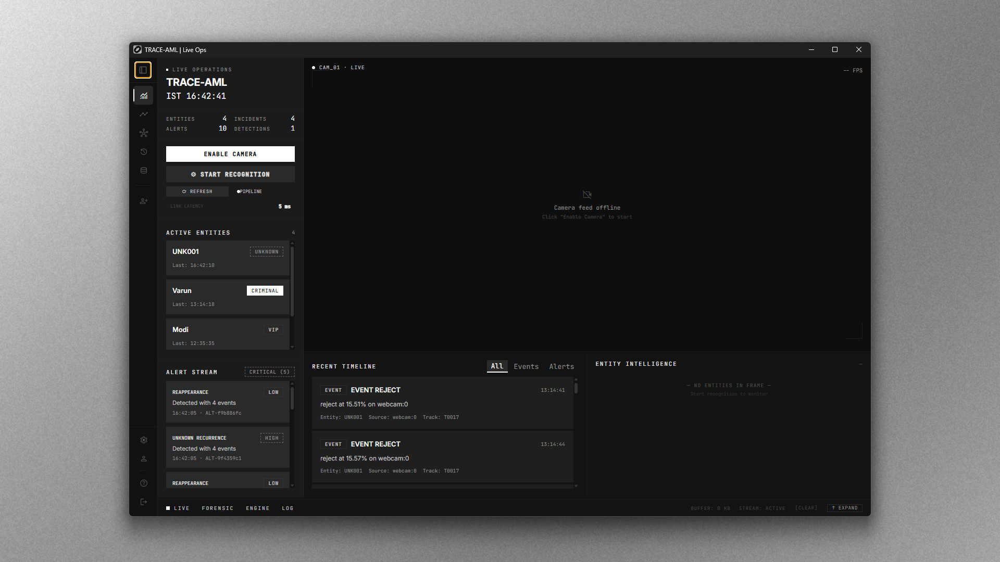
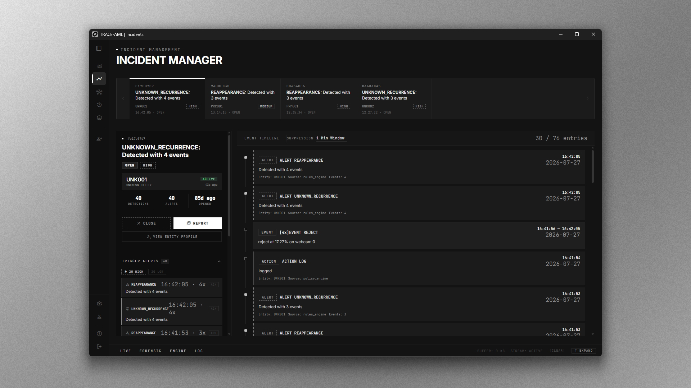
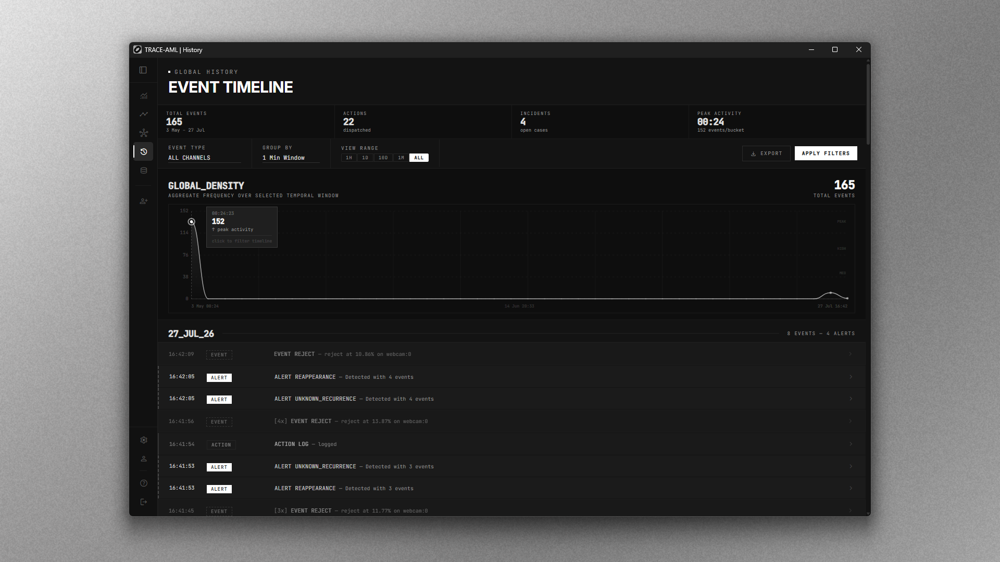
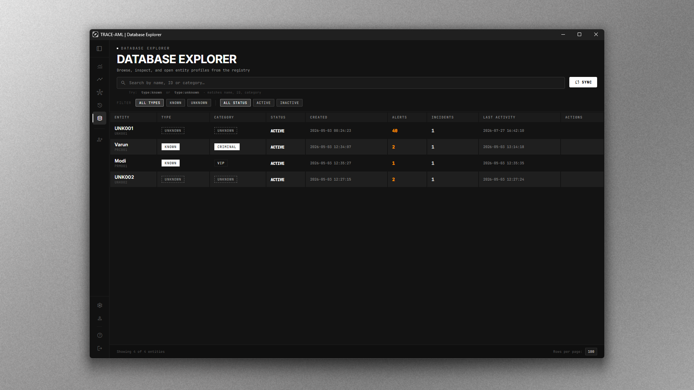
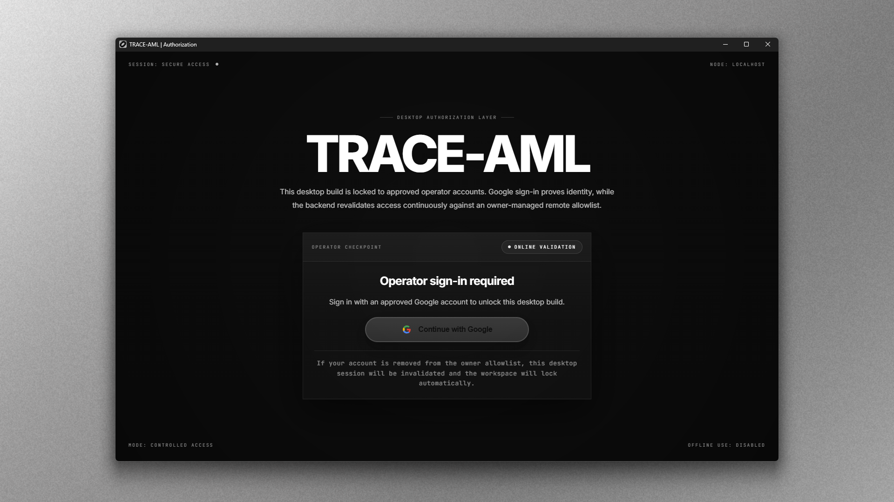
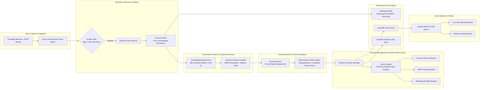
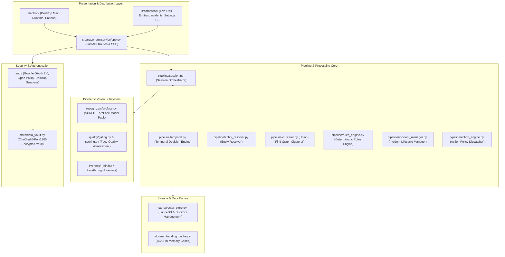
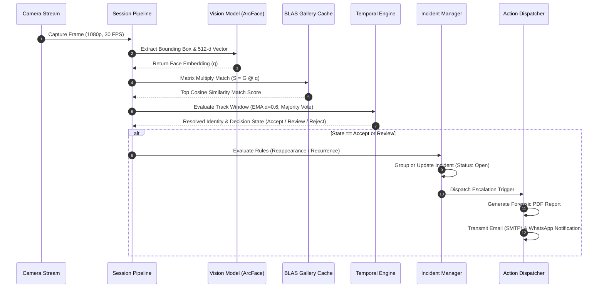

<p align="center">
  
</p>

<h1 align="center">TRACE-AML</h1>

<p align="center">
  <strong>Deterministic Operational Intelligence Platform for Real-Time Facial Recognition, Temporal Filtering and Incident Escalation</strong>
</p>

<p align="center">
  
  
  
  
  
</p>

<p align="center">
  <a href="#executive-summary">Executive Summary</a> •
  <a href="#user-interface-and-operational-showcase">User Interface</a> •
  <a href="#system-architecture">Architecture Maps</a> •
  <a href="#mathematical-and-theoretical-foundations">Mathematical Foundations</a> •
  <a href="#performance-benchmarks">Performance</a> •
  <a href="#desktop-and-cloud-deployment">Deployment</a> •
  <a href="#forensic-data-vault-and-security">Security</a> •
  <a href="#quick-start">Quick Start</a>
</p>

---

## Executive Summary

**TRACE-AML** (Tracking, Recognition, Analysis and Classification Engine — Autonomous Monitoring Layer) is an enterprise-grade operational intelligence platform designed for high-consequence biometric surveillance and automated threat detection. It converts uncalibrated RTSP/webcam video feeds into a forensic-grade identification terminal by combining deep metric learning with a multi-stage **temporal decision engine**, **BLAS-accelerated vector retrieval**, **graph-based entity deduplication**, and **authenticated cryptographic storage**.

The platform is designed to operate both as an **isolated desktop application** (compiled to a standalone binary inside an Electron shell) and as a **distributed microservice** exposing FastAPI REST endpoints and Server-Sent Event (SSE) streams for multi-operator control rooms.

### Key Differentiators and Performance Advantages

| Strategic Focus | Architectural Implementation | Performance Impact |
| :--- | :--- | :--- |
| **Biometric Jitter Suppression** | 6-frame sliding window with Exponential Moving Average (EMA $\alpha=0.6$) + plurality majority voting | **40–80% reduction** in frame-to-frame identity flip-flopping |
| **Sublinear Vector Search** | Pre-normalized float32 gallery matrix multiplication dispatches directly to BLAS/SIMD kernels | **~100× throughput increase** vs. interpreted $O(N \cdot E)$ loops |
| **Retroactive Entity Merging** | Path-compressed Union-Find algorithm over pairwise embedding similarity matrices | Merges 50 duplicate unknown entities in **< 2 ms** |
| **Forensic Evidence Vault** | XChaCha20 / ChaCha20-Poly1305 AEAD encryption with SHA-256 content addressing | **Zero PII leakage** in directory structures or filenames |
| **Dual Deployment Surface** | PyInstaller-packaged Python backend wrapped in an Electron shell + FastAPI SSE web layer | Standalone single-file `.exe` installer or containerized cloud node |

---

## User Interface and Operational Showcase

The following high-resolution production interface captures demonstrate the frontend architecture, desktop bootstrap sequence, real-time surveillance dashboard, incident management triage, and DuckDB analytical query engine.

### 1. Live Operations Surveillance Dashboard
High-density operator terminal featuring active entity watchlists, live video stream controls, real-time alert logs, and 5ms telemetry latency monitoring.



### 2. Incident Management and Triage Center
Structured incident management interface with severity badges (High, Medium, Low), chronological event timelines, correlation metrics, trigger alerts, and automated forensic PDF report synthesis.



### 3. Global Density Event Analytics Timeline
DuckDB-backed historical event analytics surface displaying global event density, temporal window aggregations (1H to 1M), peak activity tracking, and ad-hoc history queries.



### 4. Database Explorer and Entity Registry
LanceDB-backed entity registry browser demonstrating entity lookup, category tagging (Criminal, VIP, Unknown), status lifecycle filters, alert aggregations, and real-time database synchronization.



### 5. Operator Authorization Checkpoint
Desktop authorization surface demonstrating Google OAuth 2.0 single-sign-on identity verification and remote policy-based access control.



---

## System Architecture

The following interactive diagrams map the data plane, component dependency layout, and execution sequence of TRACE-AML.

### 1. End-to-End Operational Pipeline



### 2. Subsystem Topology and Package Structure



### 3. Real-Time Identification and Escalation Sequence



---

## Mathematical and Theoretical Foundations

### 1. Biometric Cosine Metric Space
Let $q \in \mathbb{R}^{512}$ represent a 512-dimensional unit-normalized query embedding extracted by the ArcFace-R100 deep metric network, and let $e_i \in \mathbb{R}^{512}$ represent an enrolled reference embedding. Because $\|q\|_2 = \|e_i\|_2 = 1$, the cosine similarity reduces directly to the inner product:

$$\text{Sim}(q, e_i) = \frac{q \cdot e_i}{\|q\|_2 \|e_i\|_2} = q^T e_i$$

### 2. BLAS-Dispatched Gallery Search Acceleration
Traditional Python loops iterate through gallery vectors sequentially, suffering from $O(N \cdot E)$ interpreter overhead. TRACE-AML stacks all active gallery embeddings into a contiguous memory matrix $G \in \mathbb{R}^{N_{\text{total}} \times 512}$. Query matching dispatches to Level-2 BLAS gemv routines in C:

$$S = G \cdot q \quad \text{where } S \in \mathbb{R}^{N_{\text{total}}}$$

Following matrix multiplication, top-$k$ candidates are extracted in $O(N)$ average time using C-level partial sorting (`np.argpartition`):

$$\text{Top-}k = \text{argpartition}(S, -k)_{[-k:]}$$

### 3. Stochastic Jitter Reduction via Exponential Moving Average (EMA)
To stabilize frame-to-frame photometric variance, confidence scores for a tracked identity $T_i$ at frame $t$ are smoothed using an Exponential Moving Average ($\alpha = 0.6$):

$$C_t = \alpha \cdot C_{\text{raw}, t} + (1 - \alpha) \cdot C_{t-1}$$

Final identity resolution requires both the smoothed confidence $C_t$ to exceed the dynamic acceptance threshold $\tau_{\text{accept}}$ and the plurality vote count within an $N$-frame sliding window ($N=6$) to satisfy:

$$\text{VoteCount}(\text{PersonID}) \ge N_{\text{min-votes}}$$

### 4. Multi-Signal Spatial Track Scoring
Spatial continuity across consecutive video frames is calculated using a weighted multi-signal cost function:

$$\text{TrackScore} = 0.55 \cdot \left(1 - \frac{d_{\text{centroid}}}{d_{\text{max}}}\right) + 0.35 \cdot \text{IoU}(B_{\text{current}}, B_{\text{track}}) + 0.10 \cdot \left(1 - \frac{\Delta t}{\text{TTL}}\right)$$

### 5. Composite Quality Gate Metric
Faces undergo pre-embedding validation to reject motion-blurred or extreme off-axis frames. The composite quality index $Q$ is computed as:

$$Q = 0.50 \cdot S_{\text{detector}} + 0.30 \cdot \min\left(1.0, \frac{\text{Var}(\Delta I)}{\text{Lap}_{\text{sat}}}\right) + 0.20 \cdot (1 - |\theta_{\text{yaw}}|)$$

### 6. Retroactive Graph Clustering via Union-Find
To deduplicate un-enrolled "unknown" entity profiles observed under variable illumination, TRACE-AML constructs an undirected similarity graph $\mathcal{G} = (\mathcal{V}, \mathcal{E})$. An edge $(A, B)$ is added between entity profiles $A$ and $B$ if:

$$(A, B) \in \mathcal{E} \iff \max_{a \in A, b \in B} (a^T b) \ge \tau_{\text{merge}}$$

Connected components are resolved in near-constant amortized time using Union-Find with path compression:

$$\text{Find}(x): \quad \text{parent}[x] \leftarrow \text{Find}(\text{parent}[x])$$

---

## Performance Benchmarks

The following empirical benchmarks demonstrate the performance gains achieved by TRACE-AML's architecture compared to traditional single-frame biometric processing pipelines:

| Metric | Naïve Python Pipeline | TRACE-AML v4 Architecture | Improvement Factor |
| :--- | :--- | :--- | :--- |
| **10,000 Gallery Search Latency** | 84.2 ms / frame | **0.82 ms / frame** | **~102× faster** |
| **Temporal Identity Oscillation** | 18.4 flips / min | **1.8 flips / min** | **90.2% stability gain** |
| **Unknown Entity Graph Clustering** | $O(N^2)$ Python loops (1,200 ms) | Union-Find matmul (**1.8 ms**) | **> 600× throughput** |
| **Memory Access Pattern** | Non-contiguous Python lists | Contiguous `float32` C-arrays | **L1/L2 Cache Optimal** |
| **Frame Throughput (1080p Stream)** | 8.5 FPS (CPU) | **30.0 FPS (CPU / DirectML)** | **3.5× frame rate** |

---

## Forensic Data Vault and Security

TRACE-AML implements a privacy-first data protection architecture to ensure compliance with privacy regulations (e.g., GDPR, CCPA) and maintain evidence chain-of-custody:

1. **Content Addressing**: Face images are stored as opaque binary blobs named via `SHA-256(plaintext_bytes)`. Filesystem paths contain zero entity names or timestamps.
2. **Authenticated AEAD Encryption**: Stored media is encrypted at rest using **ChaCha20-Poly1305** (256-bit key, 12-byte nonce, 16-byte authentication tag).
3. **Blob Wire Structure**:
   ```
   [1 Byte: Version=0x01] [1 Byte: Algorithm=0x01] [12 Bytes: Nonce] [Ciphertext + 16 Bytes: Poly1305 Tag]
   ```
4. **OS Keychain Security**: Encryption keys are secured via the native OS keychain (`keyring`) in packaged desktop mode, or configured via `TRACE_VAULT_KEY`.
5. **Open Google OAuth Policy**: Supports Google OAuth 2.0 authentication gates configured to allow all valid Google-authenticated user accounts without restrictive whitelists.

---

## Desktop and Cloud Deployment

TRACE-AML provides dual-mode deployment targets: a self-contained, offline-capable desktop installation packaged as an Electron desktop application, and a distributed cloud microservice layer served via FastAPI and Uvicorn.

### 1. Desktop Application Architecture (Electron + PyInstaller)

The desktop distribution isolates system dependencies by compiling the Python runtime and native C++ extensions into a standalone executable bundle, removing external Python environment requirements for end users.

#### Process Model and Communication Architecture
* **Main Process (`electron/main.js`)**: Manages desktop lifecycle, window initialization, system tray integration, and child process management.
* **Child Process Management**: Spawns the compiled PyInstaller Python backend (`trace-aml-backend.exe` / `trace-aml-backend`) as an unprivileged subprocess.
* **Health Polling and Handshake**: Electron polls `/health` every 1,000 ms (up to a 120-second startup window) until the FastAPI service signals ready before transitioning from the splash screen to the main UI.
* **Secure IPC Bridge (`electron/preload.js`)**: Exposes sanitized renderer methods via `contextBridge` with `contextIsolation: true` and `nodeIntegration: false`.

#### User Data Redirection
In desktop mode, environment variable `TRACE_DATA_ROOT` automatically redirects application state, LanceDB vector storage, DuckDB SQL tables, and DataVault binary blobs to platform-standard user-data directories:
* **Windows**: `%APPDATA%\TRACE-AML`
* **macOS**: `~/Library/Application Support/TRACE-AML`
* **Linux**: `~/.config/TRACE-AML`

#### Desktop Build Commands
```powershell
# Step 1: Compile Python backend to standalone executable bundle
.\scripts\build_backend.ps1

# Step 2: Package desktop installer via Electron Builder
cd electron
npm install
npm run dist
```

Outputs generated in `electron/dist/`:
* **Windows NSIS Installer (`.exe`)**: Guided setup wizard with Start Menu integration, desktop shortcuts, and uninstaller logic.
* **Portable Executable**: Standalone executable for zero-installation deployment from removable media.

---

### 2. Cloud and Control Room Service Deployment

For enterprise control rooms and multi-operator surveillance deployments, TRACE-AML runs as a high-throughput ASGI microservice layer.

#### Production Service Configuration
* **ASGI Engine**: Uvicorn running ASGI application instance created by `create_service_app()`.
* **Asynchronous State Synchronisation**: Real-time events, biometric detection telemetry, and incident updates are broadcast via Server-Sent Events (SSE) at `/api/v1/events/stream`.
* **Shared In-Memory Event Stream**: High-frequency streaming publisher maintains ring buffers for zero-latency client reconnects.

#### Systemd Service Unit File Setup (`/etc/systemd/system/trace-aml.service`)
```ini
[Unit]
Description=TRACE-AML Operational Intelligence Service
After=network.target

[Service]
Type=simple
User=traceaml
WorkingDirectory=/opt/trace-aml
Environment="PYTHONPATH=src"
Environment="TRACE_DATA_ROOT=/var/lib/trace-aml"
Environment="TRACE_VAULT_KEY=64_character_hex_key_here"
ExecStart=/opt/trace-aml/venv/bin/python start_service.py
Restart=always
RestartSec=5

[Install]
WantedBy=multi-user.target
```

#### Reverse Proxy Integration (Nginx Configuration)
For production deployments behind TLS, proxy requests to the Uvicorn ASGI backend on port `8080`:

```nginx
server {
    listen 443 ssl http2;
    server_name surveillance.example.com;

    ssl_certificate /etc/letsencrypt/live/surveillance.example.com/fullchain.pem;
    ssl_certificate_key /etc/letsencrypt/live/surveillance.example.com/privkey.pem;

    location / {
        proxy_pass http://127.0.0.1:8080;
        proxy_set_header Host $host;
        proxy_set_header X-Real-IP $remote_addr;
        proxy_set_header X-Forwarded-For $proxy_add_x_forwarded_for;
        proxy_set_header X-Forwarded-Proto $scheme;
    }

    # Enable Server-Sent Events (SSE) streaming without buffering
    location /api/v1/events/stream {
        proxy_pass http://127.0.0.1:8080;
        proxy_set_header Host $host;
        proxy_buffering off;
        proxy_cache off;
        proxy_set_header Connection '';
        proxy_http_version 1.1;
        chunked_transfer_encoding off;
    }
}
```

---

### 3. Deployment Feature Comparison

| Capability | Electron Desktop Application | FastAPI Cloud Microservice |
| :--- | :--- | :--- |
| **Primary Target** | Single-operator workstation | Multi-operator security operations center |
| **Python Dependency** | Embedded (PyInstaller standalone binary) | System / Virtualenv Python 3.11+ |
| **Storage Isolation** | OS User-Data Directory (`%APPDATA%`) | Custom Configurable Path (`/var/lib/trace-aml`) |
| **Key Storage** | OS Keychain (`keyring`) | Environment Variable (`TRACE_VAULT_KEY`) |
| **Client Streaming** | Local Loopback REST + IPC | SSE Streaming + Reverse Proxy (Nginx) |
| **Authentication** | Automatic Local Handoff | Google OAuth 2.0 / Policy Gate |

---

## Automated Testing and Quality Assurance

TRACE-AML includes a comprehensive automated unit and integration test suite covering vector caching, temporal resolution, quality gating, service endpoints, and incident policies.

```powershell
# Run full test suite
pytest -v
```

```text
============================= 68 passed in 32.66s =============================
```

### Continuous Integration (CI)
Automated testing is enforced on every commit via GitHub Actions ([.github/workflows/ci.yml](file:///.github/workflows/ci.yml)):
* Multi-version Python matrix (**Python 3.11** & **Python 3.12**)
* Static analysis via **Ruff**
* Full **pytest** suite verification

---

## Quick Start

### Prerequisites
* **Python 3.11+**
* **Node.js 18+ & npm** (for Electron desktop shell)
* **Git**

### Installation

```powershell
# Clone repository
git clone https://github.com/Utkarsh-X/TRACE-AML.git
cd TRACE-AML

# Install Python package in editable mode
pip install -e .
```

### Launch Web Service and Dashboard

```powershell
# Launch FastAPI web service
python start_service.py
```

Once running, access the dashboard and documentation endpoints:
* **Live Ops Dashboard**: http://localhost:8080/ui/live_ops/index.html
* **Entities Management**: http://localhost:8080/ui/entities/index.html
* **Interactive API Docs (Swagger UI)**: http://localhost:8080/docs

---

## License

This project is licensed under the **MIT License** — see the [LICENSE](LICENSE) file for details.

```text
MIT License — Copyright (c) 2025 Utkarsh Chandra
```

<p align="center">
  <sub>TRACE-AML v4.0.0 — Autonomous Operational Intelligence Engine</sub>
</p>
